  
   
  

  Most of my work lives in private repositories. What's public here is curated.

  

  

  <picture>
    <source media="(prefers-color-scheme: dark)" srcset="https://raw.githubusercontent.com/anastanvir/anastanvir/output/github-snake-dark.svg"/>
    
  </picture>

 

  

 

&nbsp;&nbsp;Expand full stack

 

**Languages** — TypeScript · JavaScript · Python

**Frontend** — React · Next.js · Svelte · Remix · Astro · Tailwind CSS · Styled Components

**Animation** — Framer Motion · GSAP · React Spring

**Mobile** — React Native · Expo

**Desktop** — Electron

**Backend** — Node.js · Express · NestJS · Fastify · Django · Flask · FastAPI

**AI** — LangChain · LangGraph · CrewAI · Open WebUI

**Data** — PostgreSQL · MongoDB · MySQL · Prisma · Drizzle

**Infra** — Docker · Nginx · Apache2 · Vercel · Netlify · Ubuntu

&nbsp;&nbsp;GitHub stats

 

  
    
  

